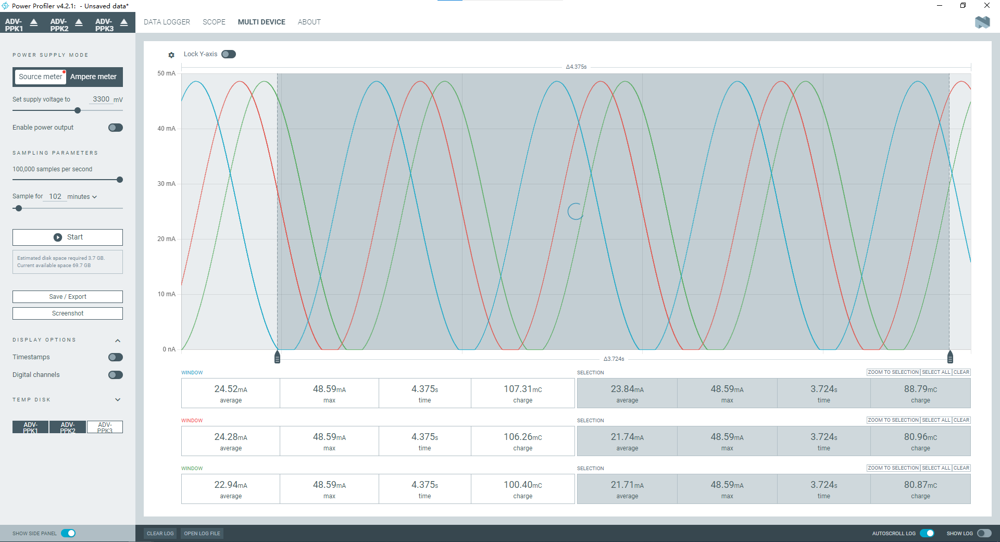

# Power Profiler 应用

Power Profiler 应用是一个用于与
[Power Profiler Kit II (PPK2)](https://www.nordicsemi.com/Software-and-tools/Development-Tools/Power-Profiler-Kit-2)
通信的工具，这是一个经济实惠且灵活的工具，用于获取设计的实时电流测量数据。

PPK 可以测量连接的 Nordic 开发套件或任何外部板的电流消耗。它为用户应用程序提供了
详细的电流分布图。



## 多设备模式功能

PPK2 多设备模式允许同时连接和监控多个 PPK2 设备，实现多设备功耗的并行测量和分析
。这个功能特别适合需要同时监测多个设备功耗的场景，如多设备对比测试、系统级功耗分
析等。

### 主要特性

-   支持同时连接最多 3 个 PPK2 设备
-   支持多种测量模式：数据记录器、示波器和多设备模式
-   设备间数据同步和对比分析
-   直观的多设备管理界面
-   实时数据可视化和分析

## 开发进度

<!-- eslint-disable table-pipe-alignment, table-cell-padding -->

| 状态      | 功能           | 说明                         | 完成度 |
| --------- | -------------- | ---------------------------- | ------ |
| ✅ 已完成 | 多设备基础框架 | 实现多设备管理核心功能       | 100%   |
| ✅ 已完成 | 设备选择器     | 支持多设备选择和切换         | 100%   |
| ✅ 已完成 | 数据采集       | 支持多设备并行数据采集       | 100%   |
| ✅ 已完成 | 设备状态管理   | 实时监控设备连接和运行状态   | 100%   |
| ✅ 已完成 | 基本数据可视化 | 支持多设备数据实时显示       | 100%   |
| 🔄 开发中 | 数据同步优化   | 优化多设备数据采集同步机制   | 80%    |
| 🔄 开发中 | 采样参数配置   | 支持每个设备独立配置采样参数 | 60%    |
| 🔄 开发中 | 固件版本检查   | 自动检查设备固件版本兼容性   | 40%    |
| 🔄 开发中 | 错误处理机制   | 完善设备异常处理和恢复机制   | 30%    |
| 📅 计划中 | 数据导出功能   | 支持多设备数据批量导出       | 0%     |
| 📅 计划中 | 高级分析工具   | 提供更多数据分析功能         | 0%     |
| 📅 计划中 | 配置模板       | 支持设备配置保存和加载       | 0%     |
| 📅 计划中 | 批量管理       | 支持多设备批量操作           | 0%     |
| 📅 计划中 | 远程监控       | 支持远程设备监控功能         | 0%     |

## 系统要求

-   Windows 10 或更高版本
-   macOS 10.15 或更高版本
-   Linux (Ubuntu 20.04 或更高版本)
-   Node.js 14.x 或更高版本
-   nRF Connect for Desktop 3.0 或更高版本

## 安装说明

从 nRF Connect for Desktop 应用商店安装 Power Profiler 应用或从
[Nordic Semiconductor 官网](https://www.nordicsemi.com/Products/Development-tools/nrf-connect-for-desktop/download)
下载最新版本

## 使用说明

1. 启动 nRF Connect for Desktop

2. 打开 Power Profiler 应用

3. 连接 PPK2 设备

4. 开始测量和分析

## 开发

### 环境准备

1. 安装 Node.js 和 npm

2. 安装 nRF Connect for Desktop

### 本地编译

克隆仓库：

> 建议进入 `.nrfconnect-apps\local` 目录便于开发和预览，该目录通常在 `USER` 根目
> 录下

```bash
git clone https://github.com/NordicSemiconductor/pc-nrfconnect-ppk.git
cd pc-nrfconnect-ppk
```

安装依赖：

```bash
npm install
```

启动开发服务器：

```bash
npm start
```

构建应用：

```bash
npm run build
```

打包应用：

```bash
npm run pack
```

然后将生成的 pc-nrfconnect-ppk-xxx.tgz 文件发送给用户，用户将压缩包拖入
nrfConnect 即可。

## 反馈

如果您在使用过程中遇到问题或有改进建议，欢迎通过以下方式反馈：

**软件问题**

-   在 GitHub 仓库提交 Issue
-   提供问题描述和复现步骤
-   标注软件版本号

**硬件问题**

-   在 [DevZone](https://devzone.nordicsemi.com) 提交问题
-   提供设备型号和固件版本
-   描述问题现象

**技术支持**

-   邮件：support@nordicsemi.com
-   工作时间：周一至周五 9:00-17:00

## 贡献

欢迎提交 Pull Request 来改进这个项目。在提交之前，请确保：

-   代码符合项目的编码规范
-   添加了必要的测试
-   更新了相关文档

## 许可证

本项目采用 [Nordic 5-Clause License](LICENSE) 许可证。
